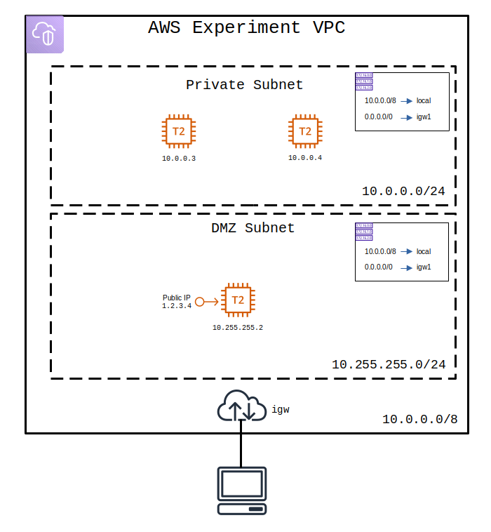

# Terraform Experiments - AWS

A simple VPC with a DMZ and private network for internal services. Starts up 1 bastion host in the DMZ and two workload services on the private network.

The DMZ bastion host is accessible via ssh from `0.0.0.0/0`.

The workload hosts are only accessible via ssh from the DMZ `10.0.1.0/24`.

### Diagram

### How to Use

Make sure to install `terraform` and `awscli`. 

Next, use `awscli configure` to setup your AWS access token and secret key.

Next, setup terraform and use it to stand up the infrastructure:

    terraform init

    terraform apply

Now you can ssh directly to the bastion host using the generated ssh key:

    ssh -i .gen/id_rsa ubuntu@<bastion_public_ip>

However, a better way is to run an ssh-agent locally and then use forwarding to allow access to the workload hosts without copying the ssh key to the bastion's disk:

    # Setup the ssh-agent to forward the ssh key through the bastion host.
    ssh-agent -s
    ssh-add .gen/id_rsa

    # Connect to the bastion, forwarding the private key so that it never touches the bastion's disk.
    ssh -o ForwardAgent=yes ubuntu@<bastion_public_ip>

    # And then from the bastion DMZ you can:
    ssh ubuntu@<workload_ip>
