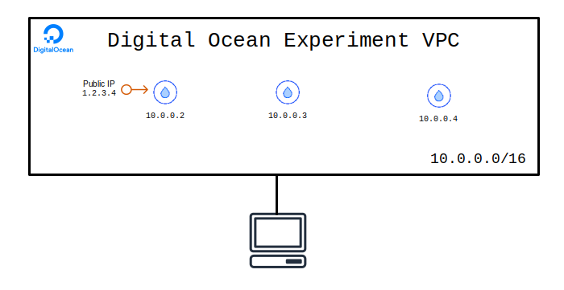

# Terraform Experiments - Digital Ocean

A simple VPC with a DMZ and a private network for internal services. Starts up 1 bastion host which the firewall will allow to speak publically and two hosts that will only be accessible from the private network. 

The bastion host is available via ssh from `0.0.0.0/0`, but the workload hosts are only accessible from `10.0.0.0/16`.

### Diagram

### How to Use

Make sure to install `terraform`.

Next create an API token on digitalocean.com and save it into `~/.digitalocean`. This will be the token used by terraform.

Next setup terraform and use it to stand up the infrastructure:

    terraform init

    terraform apply

Now you can ssh directly to the bastion host using the generated ssh key:

    ssh -i .gen/id_rsa root@<bastion_public_ip>

However a better way is to run an ssh-agent locally and then using forwarding to allow access to the workload hosts without copying the ssh key to the bastion's disk:

    # Setup the ssh-agent to forward the ssh key through the bastion host.
    ssh-agent -s
    ssh-add .gen/id_rsa

    # Connect to the bastion, forwarding the private key so that it never touches the bastion's disk.
    ssh -o ForwardAgent=yes root@<bastion_public_ip>

    # And then from the bastion you can:
    ssh root@<workload_private_ip>
